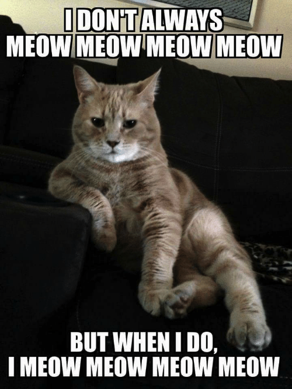

# how2meow

## Description:

## Solution:

CSP restricted to `self`, so we can only include javascript from `komodo.zoolab.org`.

Make a zip file which is also valid javascript (Polyglot), with extension as `.meow`. Since contraint to zip file’s structure is loose, we can add arbitrary text as prefix or suffix of a zip file.

1. Upload it and save the path.
   -- E.g. `PK=1/* xxxxx */eval(name)//`
2. Include the file we’ve just upload as javascript in `meow.php`, which will parse it.
   -- E.g. `?q=`
3. Get admin to access the url to `meow.php`, then admin’s cookie will be sent to our server.

Use `pow.py` to solve pow.

`FLAG{u_r_m3ow_xss_m4ster}`
